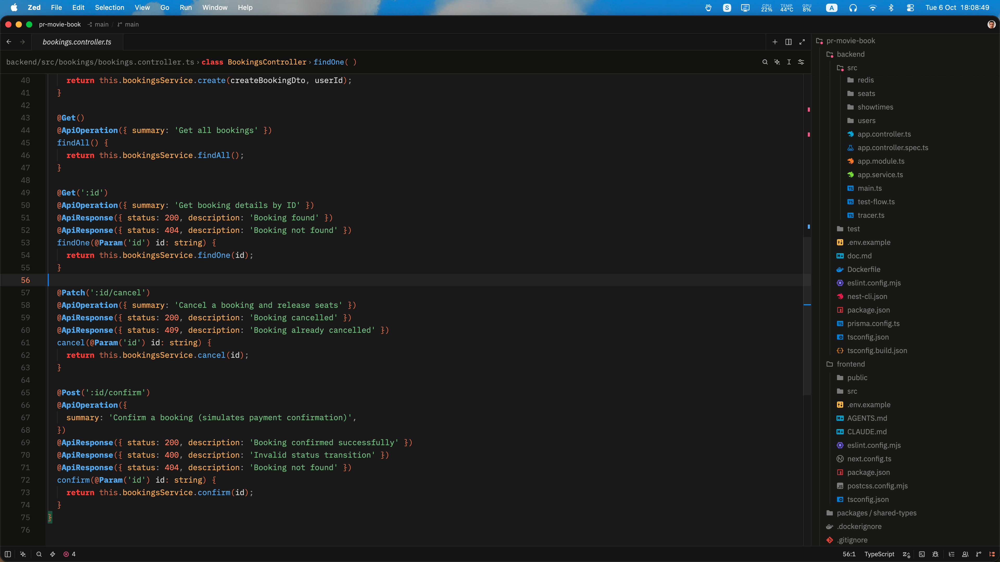
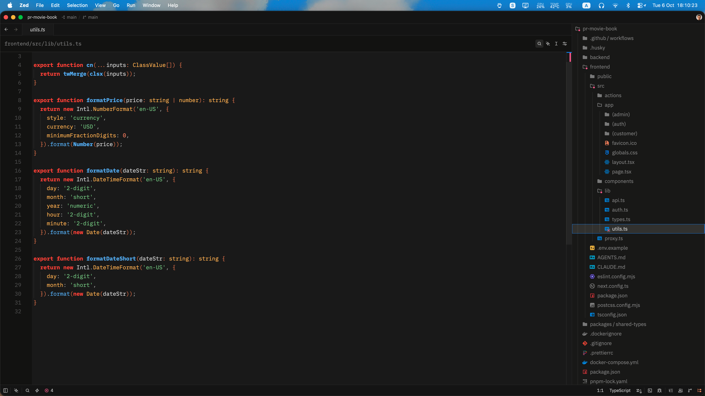

# Copper Charcoal Theme for Zed

A meticulously crafted dark theme for the Zed editor, designed to balance deep charcoal surface tones with warm copper accents, glowing amber highlights, and crisp visual hierarchy.

---

## Key Features & Design Nuances

### 1. Deep Charcoal Canvas & Panel Hierarchy

- **Rich Charcoal Canvas (`#1a1a1a`):** The primary editor background uses a deep, ultra-dark charcoal surface that keeps contrast high without causing visual fatigue during extended coding sessions.
- **Distinct Frame Layers (`#141414`):** The tab bar, title bar, and status bar use a darker, recessed tone to clearly frame your workspace.
- **UI Elements & Surface Depth (`#222222` – `#404040`):** Menus, popups, and elevated panels maintain step-by-step depth cues for seamless navigation.

### 2. Tailored Syntax Highlighting

- **Keywords & Tags (`#fb4934`):** Expressive coral-red with semibold emphasis anchors control flow and markup layout.
- **Functions & Methods (`#64b5f6`):** Crisp sky-blue with semibold weight guarantees high visibility when skimming through complex logic.
- **Types, Enums, Properties & Attributes (`#ffb74d`):** Warm golden-amber highlights object properties, HTML/JSX attributes, and class declarations.
- **Strings & Links (`#81c784`):** Soft sage-green offers a calm, balanced contrast for string literals, URIs, and regex expressions.
- **Numbers, Booleans & Constants (`#ff8a65`):** Bright peach-coral brings scalar values, booleans, and numeric constants into immediate focus.
- **Operators & Copper Accents (`#d97749` & `#e5885c`):** Rich burnt-copper hues group mathematical logic, brackets, delimiters, and embedded expressions.
- **Comments & Predictive Text (`#666666` – `#888888`):** Muted charcoal-grey with italic styling reduces cognitive clutter for non-executable metadata.

### 3. Integrated Diagnostics & VCS Statuses

- **Diagnostics:** Errors are flagged in vibrant rose (`#f06292`), warnings glowing in warm copper (`#e5885c`), and info notifications highlighted in clean sky-blue (`#64b5f6`).
- **Git Status:** Added files glow in sage-green (`#81c784`), modified lines highlight in copper (`#e5885c`), and deletions pull attention with distinct rose (`#f06292`).

### 4. Active Navigation Cues

- **Active Line Focus:** The current editor line number glows in glowing copper (`#e5885c`) against a soft overlay (`#242424`).
- **Focused Borders:** Active split panes, focus rings, and selected state accents stand out with a signature copper border (`#e5885c`).

### 5. Theme Preview

